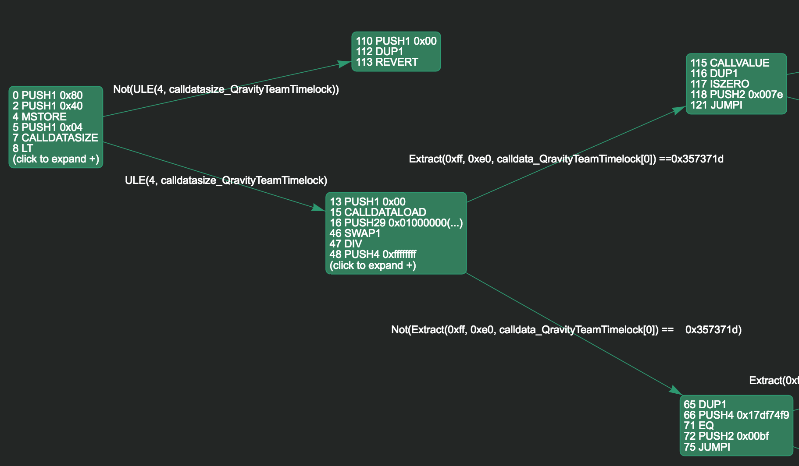

# QCOToken.sol Audit

```
Author: Ralph Pichler (RIAT, Drop all Tables GmbH)
Date: 27.07.2018
Repository: https://github.com/QravityQCOGmbH/smartcontracts
Commit: 063a87eb226454aa4669d35a9ec996d54e031b80
```

## Disclaimer

This audit was conducted in a limited amount of time (1 day) and it is possible that additional issues and bugs have gone unnoticed. It did not include formal verification of any kind. This audit makes no warrantees about the safety of the code, the absence of bugs or its conformity to the Qravity whitepaper or any other promises made by Qravity. The audit document is for informational purposes only.

## Scope

This audit is for the `QCOToken` contract (and its test suite). This also includes other contracts it uses (`Bonus` and `QravityTeamTimelock`) but only in the context of being used by `QCOToken`, not as a standalone deployment (e.g. `QravityTeamTimelock` can be trivially broken if used with another ERC20 token).

It is also assumed that the ICO parameters are within reasonable bounds (e.g. unrealistic cases where `ETH_QCO` is set to `2^255` and thus contributions would `revert` due to `SafeMath` were not considered).

## Methodology & Tools

The code (including all its dependencies) was reviewed manually multiple times. Special attention was paid to common sources of contract bugs such as:
* non 0 gas calls to untrusted contracts (occurs only in `rescueToken`)
* unchecked overflow or potential stuck contracts due to checked overflow
* unaccounted payments (`SELFDESTRUCT`, pre-existing balances, mining rewards, etc.)
* bounds and maximum gas consumption of for loops
* various ways an attacker might attempt to block code execution (e.g. `.transfer` to different addresses in the same call)


In addition it was passed through security tools such as `securify.ch`, `mythril` and `oyente`. Those tools compile a list of potential issues in the code. Every raised issue (most of which turned out to be false positives) was then reviewed manually.

Example of an issue raised by `mythril`:
```
==== Message call to external contract ====
Type: Informational
Contract: QravityTeamTimelock
Function name: fallback()
PC address: 984
This contract executes a message call to to another contract. Make sure that the called contract is trusted and does not execute user-supplied code.
--------------------
In file: QravityTeamTimelock.json:44

token.balanceOf(this)

--------------------
```

In addition control flow visualizers (`mythril`, `solgraph`) were used to look for unexpected paths of execution (however not every path was traversed in its entirety).



## Findings

#### burnAndFinish: Transfer event is fired with wrong value

Severity: **Medium**

In the `burnAndFinish` function two `Transfer` are fired:
* the transfer from the `reserves` account to the `teamWallet`
* the burning of excessive tokens in the `reserves` account

The amount for the `teamWallet` is contained in the value of both events. As a consequence this contract is currently not ERC20 compliant and block explorers which compute token balances based on `Transfer` events would show a too low value for the `reserves` account.

```solidity
uint256 teamAmount = totalSupply.mul(22).div(100);
balances[teamWallet] = teamAmount;
Transfer(reserves, teamWallet, teamAmount);

uint256 reservesAmount = totalSupply.sub(soldTokens).sub(teamAmount);
// Burn all tokens over the target amount.
Transfer(reserves, 0x0, balances[reserves].sub(reservesAmount));
balances[reserves] = reservesAmount;
```

To fix this the `teamAmount` should be substracted from the value in the event:

```solidity
Transfer(reserves, 0x0, balances[reserves].sub(reservesAmount).sub(teamAmount)
```
#### burnAndFinish: adding a presale amount to teamWallet leads to an inconsistent totalSupply

Severity: **Low**

In the `burnAndFinish` function the balance of the `teamWallet` is set to the `teamAmount` directly rather than being increased by it. This implies that any token previously added to the `teamWallet` will be burned (which can happen through `addPresaleAmount`) without decreasing the `totalSupply` leading to an inconsistency between the `totalSupply` variable and the sum of all token balances. This is of low severity because it can only be done by the `tokenAssignmentControl` account (which is controlled by the ICO operators).

```solidity
uint256 teamAmount = totalSupply.mul(22).div(100);
balances[teamWallet] = teamAmount;
```

## Additional Remarks

#### Usage of block numbers

The contract uses a block number for the end of the ICO rather than a timestamp. While this can be an advantage for short time periods due to miner manipulation of timestamps, timestamps are usually more predictable for longer time periods (especially once the difficulty bombs become noticeable again).

#### Good coverage

The test coverage is very good with `solidity-coverage` reporting almost perfect statement and branch coverage. The uncovered parts only occur under very exceptional circumstance such as the ICO taking place in the year 2400.

#### Event values are not universally checked

Despite its good coverage not all values of all relevant events were checked in the tests. This would have caught the problem with the `Transfer` events in `burnAndFinish`.

#### Outdated Solidity Version

This codebase uses `Solidity v0.4.19` (according to `README.md`) which was released in November 2017. It is highly recommended to use a recent version of Solidity as the compiler has had bugs in the past. However it appears that none of the compiler bugs would affect this contract. Furthermore the version deployed to testnet appears to have been compiled with latest version of Solidity.

## Recommendations

#### Add a value parameter to rescueToken

It might be useful add a `value` parameter to the rescueToken function instead of calling `token.balanceOf(this)` as some ERC20 tokens might modify the balance in the `transfer` call prior to the actual `transfer` (e.g. applying fee payments).

#### Allow rescueToken to be called in any state

There is no reason to restrict `rescueToken` only to the operational state. This could lead to stuck token if the ICO is aborted.
